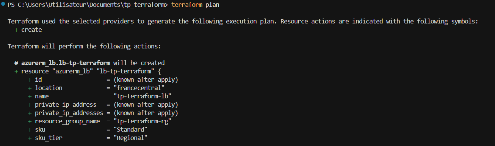
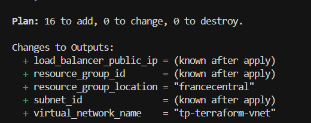
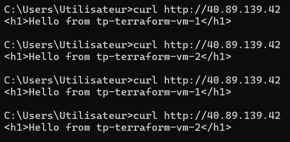
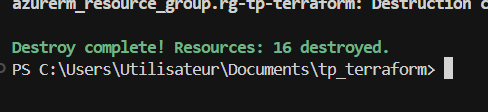

# TP Terraform – Azure Load Balancer avec 2 VMs Linux

## Objectif

Déployer une infrastructure Azure complète via Terraform comprenant deux VMs Linux avec Nginx, un Load Balancer public, un réseau virtuel et un NSG, le tout géré entièrement en Infrastructure as Code.

---

## Structure des fichiers Terraform

**`main.tf`** — Le cœur du projet. Contient la déclaration de toutes les ressources Azure : resource group, VNet, subnet, NSG, NICs, VMs, et le Load Balancer avec ses composants (backend pool, probe, règle). C'est ici que se passe tout le travail concret de provisioning.

**`provider.tf`** — Déclare le provider utilisé (ici `azurerm`) et sa version. C'est ce fichier qui indique à Terraform avec quel cloud/service il va travailler, et comment s'y authentifier.

**`variables.tf`** — Définit les variables utilisées dans le projet (comme `prefix` ou `location`) avec leur type et valeur par défaut. Ça permet de rendre le code réutilisable et paramétrable sans le modifier directement.

**`outputs.tf`** — Déclare les valeurs à afficher après un `terraform apply` : l'IP publique du Load Balancer, l'ID du resource group, etc. Très utile pour récupérer facilement des infos sur les ressources créées.

**`versions.tf`** — Spécifie les contraintes de version sur Terraform lui-même et sur les providers. Garantit que le projet tourne avec des versions compatibles.

**`terraform.tfstate`** — Fichier d'état généré automatiquement par Terraform. Il représente l'état réel de l'infrastructure déployée. Ne jamais le modifier à la main. Il peut contenir des données sensibles → **ne pas commiter**.

**`terraform.tfvars`** *(non pushé)* — Contient les valeurs concrètes des variables (comme l'ID de subscription). Ce fichier est volontairement exclu du dépôt via `.gitignore` pour éviter d'exposer des informations sensibles. Les variables sont référencées dans le code via `var.xxx`, jamais écrites en dur.

---

## Étapes réalisées

### 1. Initialisation du projet

Création de la structure de fichiers Terraform et initialisation avec `terraform init` pour télécharger le provider `azurerm`.

### 2. Réseau

Création d'un Resource Group, d'un Virtual Network (`10.0.0.0/16`) et d'un Subnet (`10.0.0.0/24`). Un NSG est associé au subnet avec des règles autorisant SSH (port 22), HTTP (port 80) et bloquant tout le reste en inbound.

### 3. VMs Linux

Deux VMs Ubuntu 22.04 LTS (`Standard_B1s`) sont créées, chacune avec sa propre NIC. L'authentification se fait par clé SSH (pas de mot de passe). Un `custom_data` (cloud-init) installe automatiquement Nginx au démarrage et écrit une page HTML identifiant chaque VM.

### 4. Load Balancer

Un Load Balancer Standard avec IP publique statique est configuré avec :
- un **backend pool** associant les deux NICs
- une **health probe** HTTP sur le port 80
- une **règle de load balancing** qui distribue le trafic HTTP entrant sur les deux VMs

### 5. Plan & Apply

```bash
terraform plan
```



Le plan annonce **16 ressources à créer**.



```bash
terraform apply
```


Apply complété avec succès : **16 ressources ajoutées**, IP publique du LB : `40.89.158.11`.

### 6. Vérification du Load Balancing

```bash
curl http://40.89.139.42
```



Le Load Balancer distribue bien les requêtes en round-robin entre `vm-1` et `vm-2`. ✅

### 7. Destruction de l'infrastructure

```bash
terraform destroy
```



**16 ressources détruites** proprement. ✅

---

## Difficultés rencontrées

**Choix de la taille de VM** : Dans un premier temps, la VM était configurée en `Standard_B1ls` (512 Mo de RAM). Cette taille s'est révélée insuffisante pour faire tourner Nginx correctement. J'ai dû passer à `Standard_B1s` (1 Go de RAM) pour que le service web démarre et réponde aux health probes du Load Balancer.

---

## Sécurité

L'ID de subscription et autres valeurs sensibles ne sont **jamais écrits en dur** dans le code. Ils sont passés via `terraform.tfvars` (exclu du dépôt) et référencés uniquement via des variables Terraform. Cela évite toute exposition accidentelle sur le dépôt Git.

---

## Pistes d'amélioration

**Utilisation d'un `for_each`** : Actuellement, VM1 et VM2 sont déclarées explicitement et séparément dans le `main.tf`, ce qui entraîne de la duplication de code. Une amélioration serait de définir les VMs via un `for_each` sur une map ou un set, ce qui rendrait le code plus concis, maintenable, et facilement scalable si l'on souhaite ajouter une troisième VM.

```hcl
# Exemple de refactoring avec for_each
locals {
  vms = toset(["vm-1", "vm-2"])
}

resource "azurerm_linux_virtual_machine" "vms" {
  for_each = local.vms
  name     = "${var.prefix}-${each.key}"
  # ...
}
```

---

## Prérequis

- Terraform >= 1.x
- Azure CLI configuré (`az login`)
- Une paire de clés SSH générée (`id_tp_azure` / `id_tp_azure.pub`)
- Un fichier `terraform.tfvars` local avec les valeurs de variables (non versionné)
